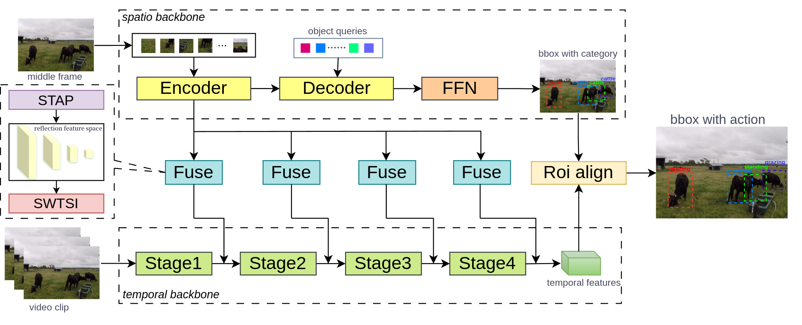

# EDST-Net
  Source code of _"EDST-Net： An Efficient Dual-Stream Parallel Framework for Spatio-Temporal Action Detection of Multi Cattle Behaviors"_

  

## 1.Installiation
  Please find installation instructions for pytorch and EDST-Net in [INSTALL.md](INSTALL.md)

## 2.Preparation

### Data preparation
  You may follow the instructions in [DATASET.md](DATASET.md) to prepare the ava format datasets.
### Model preparation
  We pretrain the LW DETR on the CVB dataset. Please refer to the following link to download the pretrained models and put them into weights/. Then modify CHECKPOINT_LWDETR in config file to you lw detr file path.

  We use Kinetics 400 pretrain weight for our temporal. Please refer to the following link to download the pretrained models and put them into weights/. Then modify CHECKPOINT_FILE_PATH in config file to you temporal backbone file path.
[temporal backbone]()
  Or you can train you own pretrain LW DETR model following the link [LW-DETR](https://github.com/Atten4Vis/LW-DETR)

## 3.Inference Demo with Pretrained Model
  We’ve provided demo for visualizing the customized input videos using pretrained weights.

  For visualizing demos:

  1. Download the pretrained weights from the link above.
     [EDST-Net](https://drive.google.com/file/d/16MXBZ_0bQvNuvB7myYq0dmB6rstEvXUv/view?usp=sharing)
  
  3. Set DEMO.ENABLE to 'True' and set TRAIN.ENABLE, TEST.ENABLE to 'False'.
  
  4. Modify LABEL_FILE_PATH,INPUT_VIDEO and OUTPUT_FILE as your own label path.
  
  5. Using the provided run_net.py to demo the input videos. Run it as:
  
    python run_net.py --cfg your/file_path/edst.yaml

## 4. Train
  You can modify TRAIN.ENABLE to 'True' and directly run `run_net.py` file for the training process.
  
## 5. Test
  You can modify TEST.ENABLE to 'True' and directly run `run_net.py` file for the training process. Please refer to [3.Inference Demo with Pretrained Model](#3) to download a series of EDST-Net models.

## 6. References
Our project is conducted based on the following public paper with code:

- [SLOWFAST](https://github.com/facebookresearch/SlowFast)
- [LW-DETR](https://github.com/Atten4Vis/LW-DETR)

