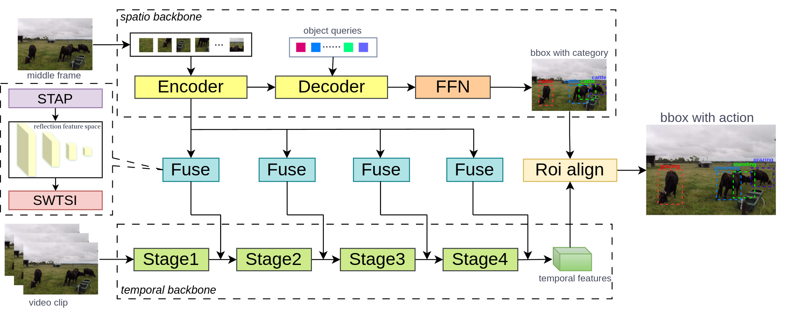

# 🐮 EDST-Net

Source code of  
**_“EDST-Net: An Efficient Dual-Stream Parallel Framework for Spatio-Temporal Action Detection of Multi-Cattle Behaviors”_**

<p align="center">
  
</p>

---

**Notice:**  
We have updated **Preparation** on **Oct. 3** 🛠️

We add different light simulation in line 171 to line 250 in ava_dataset.py

---

## 📋 Table of Contents
1. [Installation](#1-installation)
2. [Data Preparation](#2-preparation)
3. [Model Preparation](#3-model-preparation)
4. [Inference Demo with Pretrained Model](#4-inference-demo-with-pretrained-model)
5. [Training](#5-train)
6. [Testing](#6-test)
7. [References](#7-references)
8. [Citation](#8-citation)

---

## 1️⃣ Installation

Please find installation instructions for PyTorch and EDST-Net in  
👉 [INSTALL.md](INSTALL.md)

---

## 2️⃣ Data Preparation

### 🧩 Data Preparation

Follow the instructions in  
👉 [DATASET.md](DATASET.md)  
to prepare the **AVA-format datasets** used for training and evaluation.

---

#### 📦 Step-by-Step Dataset Annotation Pipeline

👉 [step_by_step_dataset.md](step_by_step_dataset.md)

> 🛠️ This section provides a detailed guide for building annotations matching the EDST-Net input format.

As an alternative, you can directly download our prepared annotations：

The CVB dataset annotation can be download here [cvb annotations](https://drive.google.com/drive/folders/1WThk3A8MCdO7JeB1xLiavvZ32M-cA8i5?usp=drive_link)

The CVB-i dataset annotation can be download here[cvb-i annotations](https://drive.google.com/drive/folders/1Qy8YROQUA9Thosa3RJBxUwke5kPjU86o?usp=drive_link)


## 3️⃣ Model Preparation

We pretrain the **LW-DETR** on the CVB dataset.  
Please download the pretrained weights and place them in the `weights/` folder.

🔗 [LW-DETR Pretrained Model](https://drive.google.com/file/d/1VAyJ9jrJex7s_cmNKvrtINqMznVG9Xit/view?usp=sharing)

Then modify the configuration file:

```yaml
CHECKPOINT_LWDETR: "path/to/your/lwdetr.pth"
```

If you prefer to train LW-DETR yourself, refer to the official repo:  
👉 [LW-DETR GitHub Repository](https://github.com/Atten4Vis/LW-DETR)
todo:upload cvb-i lwdetr pretrain model
---

We use **Kinetics-400 pretrained weights** for our temporal backbone.  
Please download and place them in `weights/`:

🔗 [Temporal Backbone (X3D-L)](https://dl.fbaipublicfiles.com/pyslowfast/x3d_models/x3d_l.pyth)

Then update in your config file:

```yaml
CHECKPOINT_FILE_PATH: "path/to/your/x3d_l.pyth"
```
Please print these code in your terminal before you train/test the model:

export PYTHONPATH=/media/zhong/1.0T/zhong_work/SlowFast:$PYTHONPATH
export PYTHONPATH=/media/zhong/1.0T/zhong_work/SlowFast/slowfast:$PYTHONPATH
export PYTHONPATH=/media/zhong/1.0T/zhong_work/SlowFast/Detectron2:$PYTHONPATH


You need to modify ava_helper line 14 AVA_VALID_FRAMES = range(1, 16) to range(1, 11) if you use cvb-i dataset.
And modify core/dataset/coco.py line175 PATH  ; line 66 path root_dir

## 4️⃣ Train

To start training from scratch, enable training in your config file:

```yaml
TRAIN.ENABLE: True
```

Then run:

```bash
python run_net.py --cfg your/file_path/edst.yaml
```

> 💡 You can modify batch size, learning rate, and training epochs in the YAML config file as needed.

> 💡 Modify ava_helper line 14 AVA_VALID_FRAMES = range(1, 16) to range(1, 11) if you use cvb-i dataset.
---

## 5️⃣ Test

To evaluate or test the model:

```yaml
TEST.ENABLE: True
```

Then run:

```bash
python run_net.py --cfg your/file_path/edst.yaml
```

For pretrained checkpoints, please refer to  
👉 [Inference Demo with Pretrained Model](#4-inference-demo-with-pretrained-model)

> 💡 Modify ava_helper line 14 AVA_VALID_FRAMES = range(1, 16) to range(1, 11) if you use cvb-i dataset.
> 
---

## 6️⃣ Inference Demo with Pretrained Model

We provide an **inference demo** for visualizing custom input videos using pretrained weights.

### ▶️ Steps:

1. **Download pretrained weights:**  
   [EDST-Net Pretrained Models](https://drive.google.com/drive/folders/1EYcWb0f4WfnMKLIAGcNzNOmwZjogwjNb?usp=drive_link)
   todo:upload cvb-i pretrained model
2. **Set the config flags:**
   ```yaml
   DEMO.ENABLE: True
   TRAIN.ENABLE: False
   TEST.ENABLE: False
   ```

3. **Modify paths in config:**
   ```yaml
   LABEL_FILE_PATH: "path/to/label.json"
   INPUT_VIDEO: "path/to/your_video.mp4"
   OUTPUT_FILE: "path/to/output_demo.mp4"
   ```

4. **Run the demo:**
   ```bash
   python run_net.py --cfg your/file_path/edst.yaml
   ```

The model will output a visualization video with bounding boxes and action labels for each detected cattle behavior.

---

## 7️⃣ References

Our work builds upon the following open-source projects:

- [SLOWFAST](https://github.com/facebookresearch/SlowFast)
- [LW-DETR](https://github.com/Atten4Vis/LW-DETR)

---

## 8️⃣ Citation

If you find this work useful in your research, please kindly consider citing our paper:

```bibtex
@article{zhong2025edstnet,
  title={EDST-Net: An Efficient Dual-Stream Parallel Framework for Spatio-Temporal Action Detection of Multi-Cattle Behaviors},
  author={Zhong, Huiyu and Su, Daobilige and Qiao, Yongliang and Yang, Zhe and Wang, Xuechang and Wang, Qingjie and Zhang, Xinyue},
  journal={Under Review},
  year={2025}
}
```

---

<p align="center">
  ⭐ Star this repo if you find it helpful!  
  🐄 Contributions and issues are always welcome.
</p>
